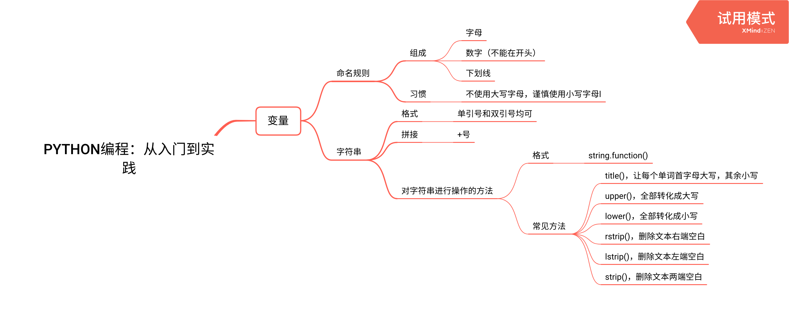

# 第3周学习报告  
`@Author 陆洪业`  
`@Date 20200315`  
```
这周除了听课和赶作业之外(难), 其他方面的学习没干啥(惭愧)
```
[Python的少量学习](#1) | [PowerToys](#2) | [编译型语言和解释性语言](#3)  
# <a id='1'>Python的少量学习</a>  
  
听到VisualDust大佬的安利, 感觉Python很牛逼, 于是终于对Python起了兴趣(之前对Python没兴趣, 脚本语言想学Julua、Lua就是没有Python, 现在真香), 不过学Python也没学多少, 还是和C类似的东西(变量都没学完...)  
emm, 之后... 主要还是搞安卓吧, Python有额外的空余时间再学习学习.  
# <a id='2'>PowerToys</a>  
这是一个窗口增强管理器, 很久之前就看到它了, 可是不一会就名字给忘了, 就记得叫Power啥还是Super啥, 谁能想到叫PowerToys(玩具?为啥一个窗口增强管理器叫玩具?迷)  
这是一个MicroSoft开发的一个窗口增强管理器, 原本Windows的窗口只能左右分屏, 而PowerToys可以让窗口按照你想要的方式分布, 一般是让他们平铺分布.  
<iframe id=sbrxp src="//player.bilibili.com/player.html?aid=77283038&page=1" scrolling="no" border="0" frameborder="no" framespacing="0" allowfullscreen="true" style="width: 640px; height: 430px; max-width: 100%"> </iframe>   
感觉不错  

# <a id='3'>编译型语言和解释性语言</a>  
编程语言可以分为两类, 一类是编译型语言,另一类是解析型语言.像C,C++这类通常是编译型语言,而像Python,Lua这类则是解析型语言.  
编译型语言的优点是执行效率一般较高,缺点则是依赖编译器得提前编译, 这也使得跨平台型差.  
而解析型语言正和编译型语言互补, 不需要提前编译, 以代码文本的形式保存, 跨平台性较强, 但是运行时一般需要逐句解释, 所以执行效率一般比编译型语言低.  
不过这样的分类并不是很严谨, 因为有些语言并不是可以这么简单地划分的, 比如Java先编译成字节码文件, 再由JVM解释运行, 网上对其是上述那类语言争论不断.  
再比如, 有些"编译型语言"比如C和C++也可以写成脚本用Ch和Cint解析运行,而像Python这类解释型语言也可以提前编译.  
