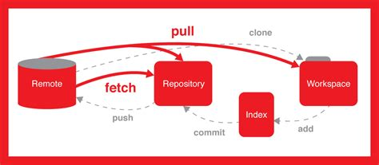

# 第N周学习报告  
`@Author 陆洪业`  
`@Date 20200221`  
[为什么要学git](#1) | [git的下载与安装](#2) | [git的基本使用](#3) | [版本操作](#4) | [撤销修改](#5) | [远程仓库](#6)

```
Git是目前世界上最先进的分布式版本控制系统，
```
# <a id='1'>为什么要学git——牛逼的Git</a>
Git是由Linus大神开发一个版本控制系统，linus独创的Git是分布式的，版本库全都是储存在本地，并且设计优良，因此有不需要联网、速度快、不会因为服务器崩溃而丢失数据、简单轻便等优点。依赖网络的集中式完全比不上，有设计缺陷的CVS和反人类的VSS更是渣渣，而笨重还贵的ClearCase只有~~人傻钱多~~财大气粗的公司才会去用。而因为Git追踪管理的是修改而不是文件,所以速度非常快.总的来说，Github巨牛逼！

# <a id='2'>git的下载与安装</a>
Windows:要不翻墙官方下载,要不找国内镜像,遇事不决Github,果然找到了https://github.com/waylau/git-for-win,下载安装包之后点击安装无脑下一步就可以了.
Linux就简单了,换了源,直接用包管理器就OK了.

安装完之后配置一下全局变量
```
$ git config --global user.name "Your Name"
$ git config --global user.email "email@example.com"
```

# <a id='3'>git的基本使用</a>
我自己划分的git基本操作有：init、add、status、commit和diff
## 一张图了解git的运作


当前文件夹为工作区(Workspace),./git/为本地仓库(Repository),./.git/index/为暂存区(Index,也称Stage),远程仓库(Remote)在服务器如Github上  

## 初始化,在当前目录创建版本库(也称仓库,图中Repository)
```
$ git init
```
## 往暂存区(图中的Index)里添加文件
```
$ git add file //添加一个文件
$ git add file1 file2 ... //添加多个文件
$ git add --all //添加全部文件
```
## 查看仓库状态
```
$ git status
```
## 将暂存区提交到本地仓库(commit之前可以用git status看一下状态)
```
$ git commit -m 提交说明
$ git commit -amand //使用是上那的提交说明,不推荐
```

## 查看文件修改了什么内容,或者说工作区和暂存区有什么不同
```
$ git diff 文件 //查看暂存区和工作区的差别
$ git diff HEAD -- 文件 //查看HEAD版本(当前版本库)和工作区的差别
```

# <a id='4'>版本操作</a>
版本操作似乎对工作区无操作

## 查看commit版本记录
```
$ git log
$ git log --pretty=oneline //只显示版本号(commit id)、操作和提交说明(message)
```
## 版本回退
```
$ git reset --hard 版本号(前四位即可,只要能匹配到)
```
上面的版本号也可以用HEAD来表示,
HEAD表示当前版本,

加一个^表示往前推一个版本,HEAD~n表示往前推n个版本

如HEAD^为上一个版本,HEAD^^表示上上个版本,HEAD~100表示网上100个版本


## 版本回退后悔药
如果后悔回退了,又看不到版本号,可以用reflog查看操作记录,前面的即为操作后的版本号,然后用版本回退的方法即可
```
$ git reflog
```


# <a id='5'>撤销修改</a>

## 还未add
使用checkout可以丢弃工作区中的修改
```
$ git checkout -- file
```
虽然这个代码可以丢弃修改,不过在我的版本提示的不是checkout,而是restore
```
$ git status
位于分支 master
尚未暂存以备提交的变更：
  （使用 "git add <文件>..." 更新要提交的内容）
  （使用 "git restore <文件>..." 丢弃工作区的改动）
	修改：     readme.md

修改尚未加入提交（使用 "git add" 和/或 "git commit -a"）
```
经观察推断git checkout -- file 和 git restore file是一样的


## 已经add

我add之后再修改工作区,查看status
```
位于分支 master
要提交的变更：
  （使用 "git restore --staged <文件>..." 以取消暂存）
	修改：     readme.md

尚未暂存以备提交的变更：
  （使用 "git add <文件>..." 更新要提交的内容）
  （使用 "git restore <文件>..." 丢弃工作区的改动）
	修改：     readme.md
```
## 撤销修改总结
当我们对我们的修改不满的时候,我们可以进行相应的操作撤销恢复

对工作区的操作
```
$ git restore file 
$ git checkout -- file 
// 俩指令一样,都是放弃工作区中的修改,默认从暂存区恢复到工作区,如果暂存区没有内容,则从本地仓库中恢复到工作区  
```
对暂存区的修改
```
$ git reset HEAD -- file // 取消暂存,--要不要都一样,HEAD可缺省,意思是将HEAD的修改拿回暂存区,不改变版本号
$ git restore --staged file // 取消暂存
// 同样俩指令一样
$ git reset commit_id // 改变版本号且拿回暂存区,取消暂存 
```
对暂存区和工作区都有作用的修改
```
$ git checkout HEAD -- file // 放弃工作区和暂存区中的修改(add没add都可以),恢复HEAD的版本,好像--要不要都可以,不过不要的话会有提示,比如"从 4f7d0d7 更新了 1 个路径"
```
## 删除文件
删除文件之后可以用撤销修改的方式撤销,即
```
$ git checkout -- file
```
或者
```
$ git restore file
```
也可以确认从版本库中删除
```
git add/rm file //add和rm效果是一样的
```

# <a id = '6'>远程仓库——Github</a>
Github是世界上最大的~~同性社交网站~~开源软件平台,也是Linus大神开发的.首先得有一个Github帐号,如果没有就注册

## 配置SSH key
如果不配置SSH key,不仅每次都要输入密码,而且还会有帐号安全问题  
### 1.创建SSH key密钥对
```
$ ssh-keygen -t rsa -C "youremail@example.com"
```
可以不用设密码,一路回车默认  
然后密钥对就会生成在用户主目录下的.ssh/文件夹里,id_rsa是私钥,不能泄露,id_rsa.pub是公钥,可以放心告诉任何人.
### 2.在Github帐号上添加SSH key公钥
登录Github,点击右上角头像,点击进入Settings,进到SSH and GPG key选择new SSH key将id_rsa.pub里的公钥复制进去,然后Add SSH key

## 创建远程仓库
创建远程仓库有两个方法,一个是直接用浏览器在Github网站上面创建,另一个方法是利用api,在命令行中用curl操作(或者在程序里面操作)
### 网站新建
登录 Github.com ,点击右上角的加号,然后New Repository或者如果在动态页,单击左边Repositories右边的New,然后填写新建.
### api新建
```
$ curl -u 用户名(:密码) https://api.github.com/user/repos -d '{"name":"仓库名","description":"仓库描述"}'
```
密码可以不填,回车之后会提示输入(因为在上面就填,密码不会隐藏)  
而且官方不推荐用密码,会引起帐号安全问题,官方推荐用tokers认证,有兴趣可以去查一下API的使用,不过我查起来有点费力


## 添加远程仓库
```
$ git remote add origin https://github.com/用户名/learngit.git
//第一种是使用密码认证的方法,这种方法不太安全,而且每次都要输密码
$ git remote add origin git@github.com:用户名/learngit.git
//第二种是使用SSH key认证的方法,既然我们使用了SSH key,那么就用第二种
//origin可以改成其它名字,只不过git习惯写origin,简单明了
```

## push
push的作用是将本地仓库的内容推送到远程仓库
```
$ git push -u origin master
```
第一次push加参数-u,就可以把该仓库的master分支设为默认分支了,以后push直接
```
$ git push
```
否则每次push都要指定仓库和分支
```
$ git push origin //未设置默认仓库分支的的时候需要指定,或者需要推的不是默认的分支,那么还是要指定
```
第一次使用SSH key push的时候,Git会输出一个警告,让你确认Github的Key的指纹信息是否真的来自Github的服务器,确认RSA key指纹信息一致后输入yes即可

## 克隆仓库
在网站上找到仓库,点击绿色的Clone or download按钮,切换你想要的协议(https或者SSH,SSH更省事),复制链接,然后执行
```
$ git clone 复制下来的链接
```
如
```
$ $ git clone git@github.com:michaelliao/gitskills.git
```
即可
